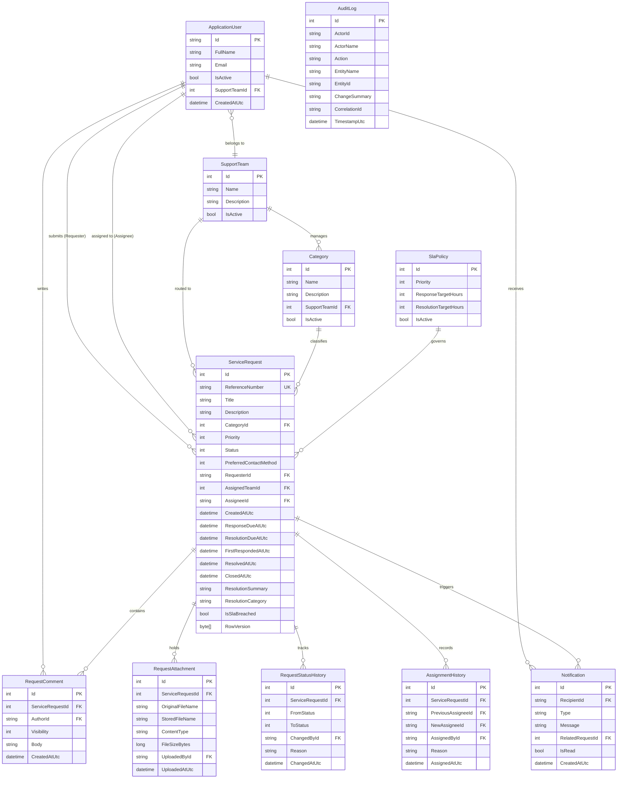

# Entity-Relationship (ER) Diagram
**Smart Service Request Management Portal (SSRMP)**

```mermaid
erDiagram
    ApplicationUser ||--o{ ServiceRequest : "submits (Requester)"
    ApplicationUser ||--o{ ServiceRequest : "assigned to (Assignee)"
    ApplicationUser }o--|| SupportTeam : "belongs to"
    ApplicationUser ||--o{ RequestComment : "writes"
    ApplicationUser ||--o{ Notification : "receives"

    SupportTeam ||--o{ Category : "manages"
    SupportTeam ||--o{ ServiceRequest : "routed to"

    Category ||--o{ ServiceRequest : "classifies"

    ServiceRequest ||--o{ RequestComment : "contains"
    ServiceRequest ||--o{ RequestAttachment : "holds"
    ServiceRequest ||--o{ RequestStatusHistory : "tracks"
    ServiceRequest ||--o{ AssignmentHistory : "records"
    ServiceRequest ||--o{ Notification : "triggers"

    SlaPolicy ||--o{ ServiceRequest : "governs"

    ApplicationUser {
        string Id PK
        string FullName
        string Email
        bool IsActive
        int SupportTeamId FK
        datetime CreatedAtUtc
    }

    SupportTeam {
        int Id PK
        string Name
        string Description
        bool IsActive
    }

    Category {
        int Id PK
        string Name
        string Description
        int SupportTeamId FK
        bool IsActive
    }

    SlaPolicy {
        int Id PK
        int Priority
        int ResponseTargetHours
        int ResolutionTargetHours
        bool IsActive
    }

    ServiceRequest {
        int Id PK
        string ReferenceNumber UK
        string Title
        string Description
        int CategoryId FK
        int Priority
        int Status
        int PreferredContactMethod
        string RequesterId FK
        int AssignedTeamId FK
        string AssigneeId FK
        datetime CreatedAtUtc
        datetime ResponseDueAtUtc
        datetime ResolutionDueAtUtc
        datetime FirstRespondedAtUtc
        datetime ResolvedAtUtc
        datetime ClosedAtUtc
        string ResolutionSummary
        string ResolutionCategory
        bool IsSlaBreached
        byte[] RowVersion
    }

    RequestComment {
        int Id PK
        int ServiceRequestId FK
        string AuthorId FK
        int Visibility
        string Body
        datetime CreatedAtUtc
    }

    RequestAttachment {
        int Id PK
        int ServiceRequestId FK
        string OriginalFileName
        string StoredFileName
        string ContentType
        long FileSizeBytes
        string UploadedById FK
        datetime UploadedAtUtc
    }

    RequestStatusHistory {
        int Id PK
        int ServiceRequestId FK
        int FromStatus
        int ToStatus
        string ChangedById FK
        string Reason
        datetime ChangedAtUtc
    }

    AssignmentHistory {
        int Id PK
        int ServiceRequestId FK
        string PreviousAssigneeId FK
        string NewAssigneeId FK
        string AssignedById FK
        string Reason
        datetime AssignedAtUtc
    }

    Notification {
        int Id PK
        string RecipientId FK
        string Type
        string Message
        int RelatedRequestId FK
        bool IsRead
        datetime CreatedAtUtc
    }

    AuditLog {
        int Id PK
        string ActorId
        string ActorName
        string Action
        string EntityName
        string EntityId
        string ChangeSummary
        string CorrelationId
        datetime TimestampUtc
    }
```
